# ERP Builder — Modules, Plugins & Blocks Design Guide

> Har suggested module ka schema, pages, relations — aur plugins/blocks kaise add karein.
> All diagrams are in Mermaid format — GitHub renders them automatically.
> Use [mermaid.live](https://mermaid.live) to open any individual block interactively.

---

## 1. Module Architecture (How Packs Work)

A **Pack** = a `PackDefinition` object in `registry.ts`. Installing it **materialises** tables, fields, seed data, and pages into the workspace DB.

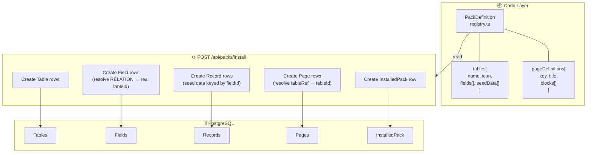

**Rule:** RELATION fields sirf un tables ko link kar sakte hain jo pack mein **pehle** define hue hain (order matters during fresh install).

---

## 2. Suggested Module Packs

---

### 2.1 CRM & Sales Pack

**Category:** Sales · **Badge:** Free · **Target:** B2B businesses

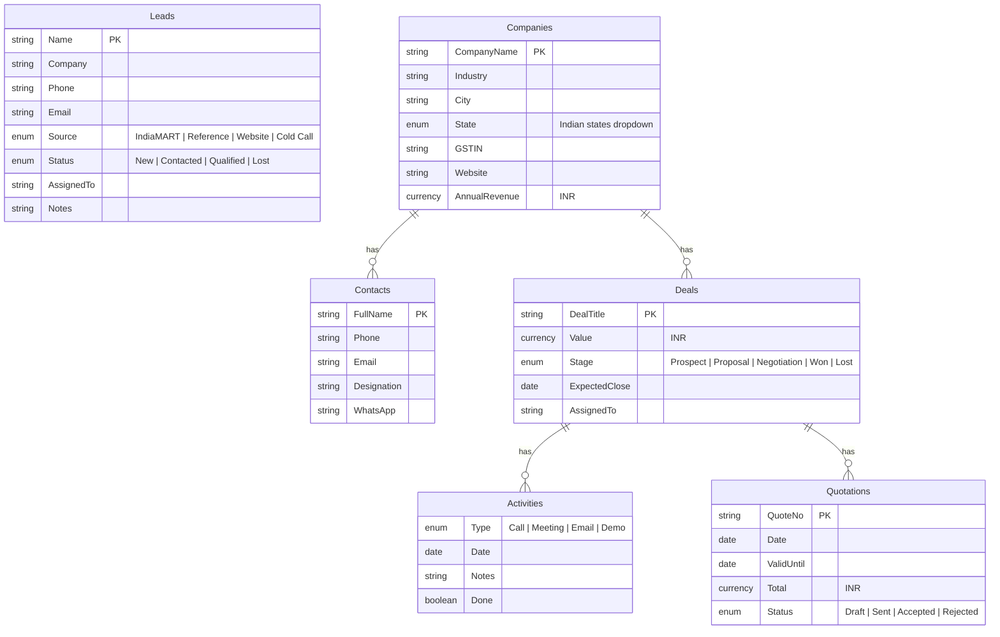

#### Pages

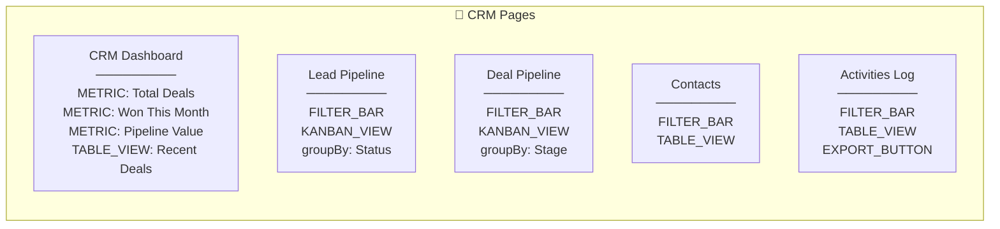

---

### 2.2 HR & Payroll Pack

**Category:** HR & Payroll · **Badge:** Free · **Target:** 10–200 person companies

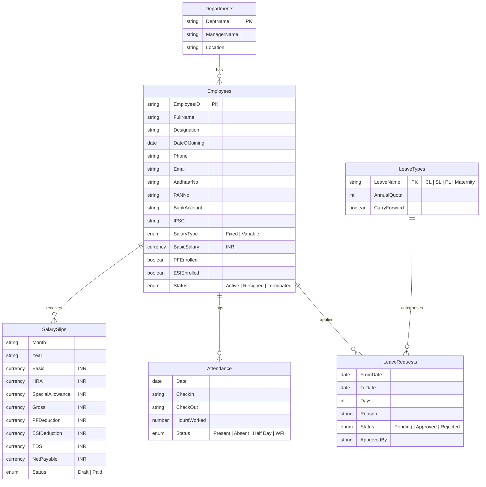

#### Pages

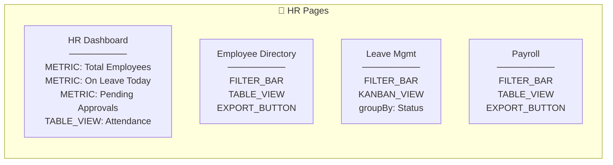

---

### 2.3 Manufacturing Pack

**Category:** Operations · **Badge:** Free · **Target:** Factories, workshops

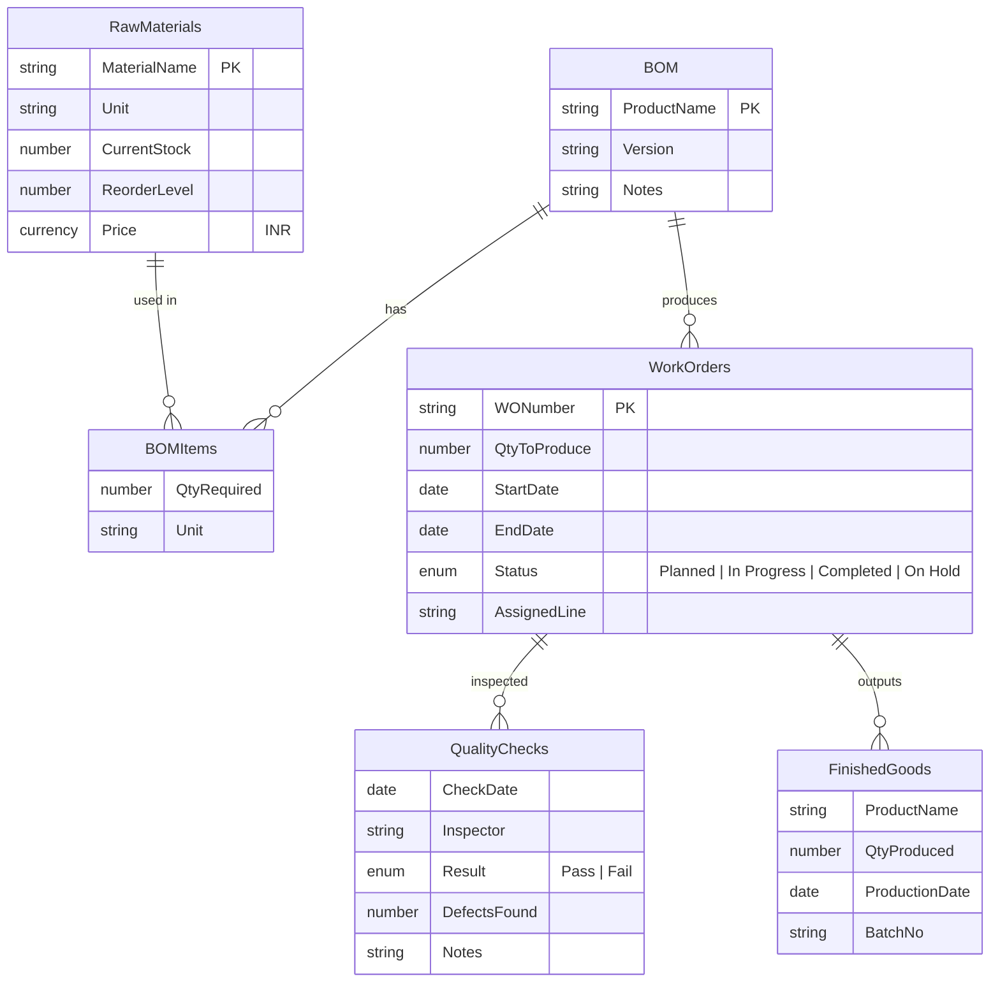

---

### 2.4 Field Sales Pack

**Category:** Sales · **Target:** FMCG distributors, traders

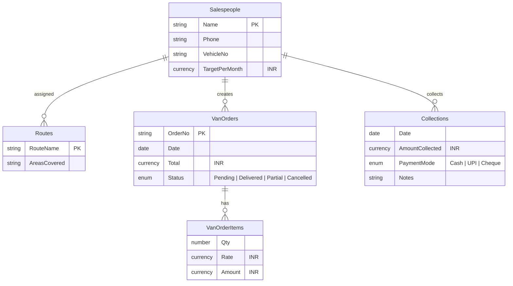

---

### 2.5 Service & Maintenance Pack

**Category:** Operations · **Target:** AMC / repair companies

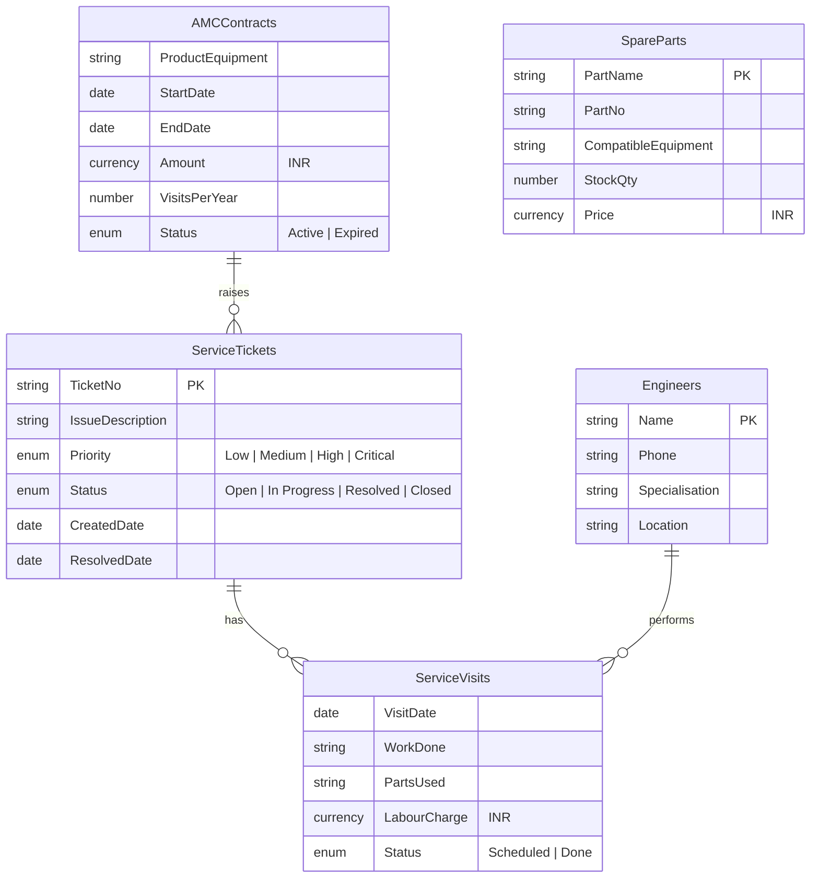

---

### 2.6 Module Dependency Graph

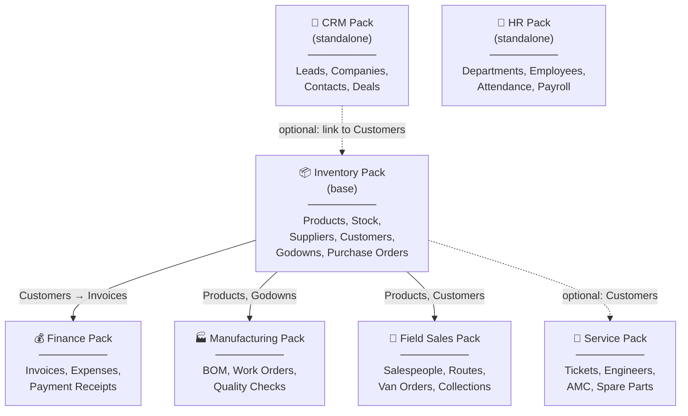

---

## 3. Plugin Architecture

### How Plugins Work

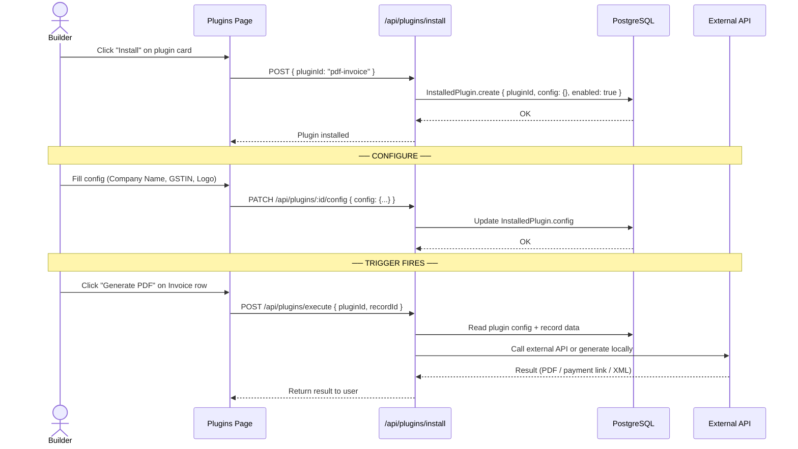

### Plugin Trigger Types

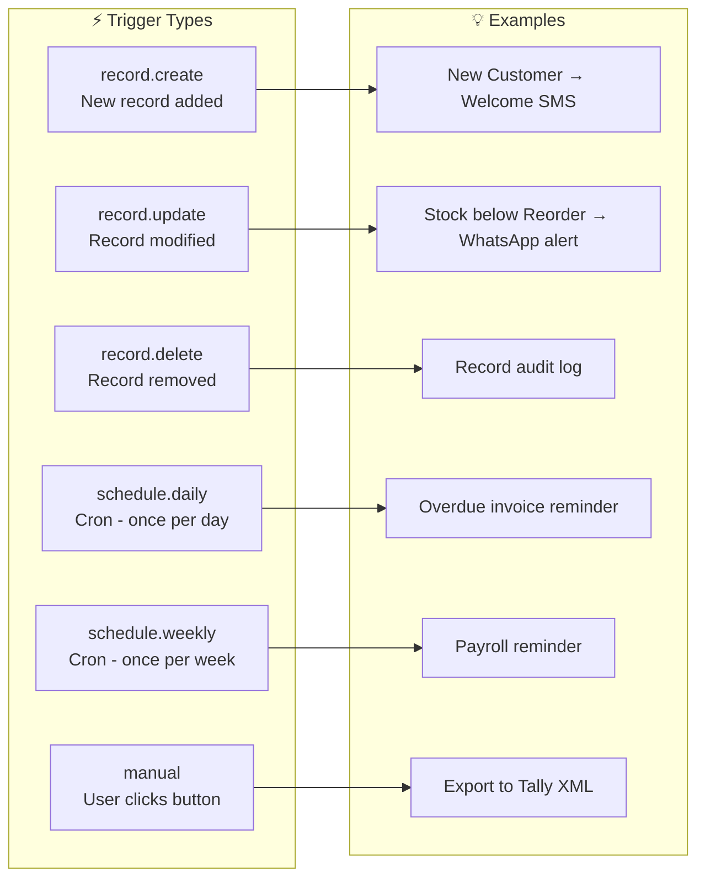

---

### Suggested New Plugins

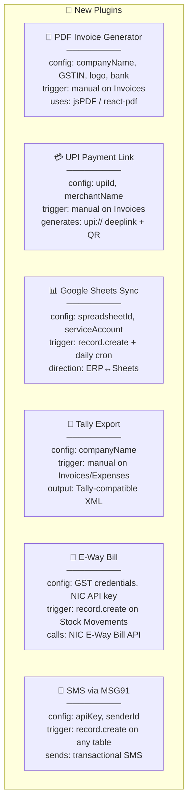

#### Plugin Config Structure

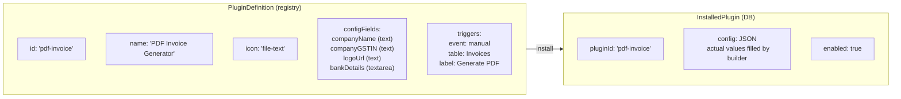

---

## 4. New Block Types

### Currently Existing

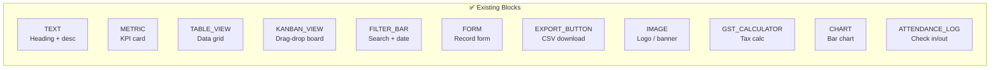

### Suggested New Blocks

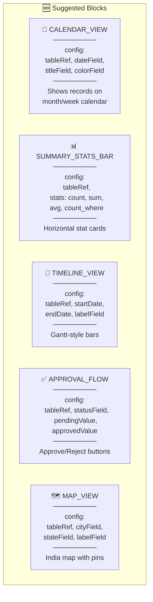

#### Calendar View — Data Flow

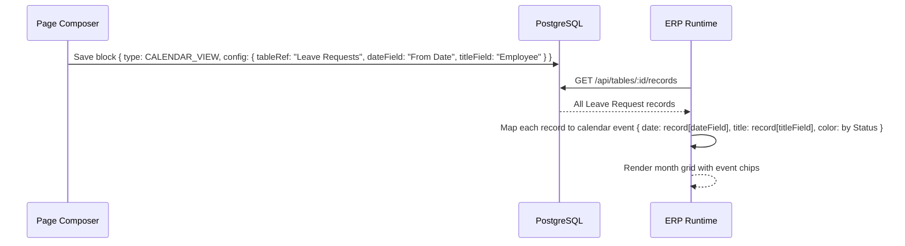

#### Approval Flow — Data Flow

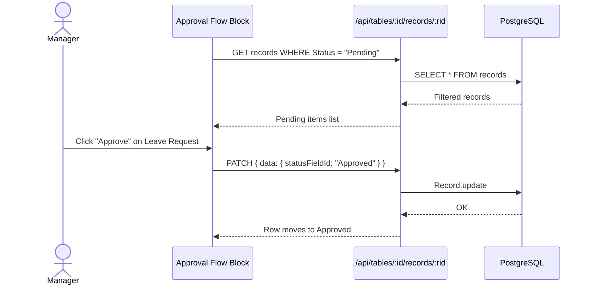

---

## 5. How to Add a New Module (Step by Step)

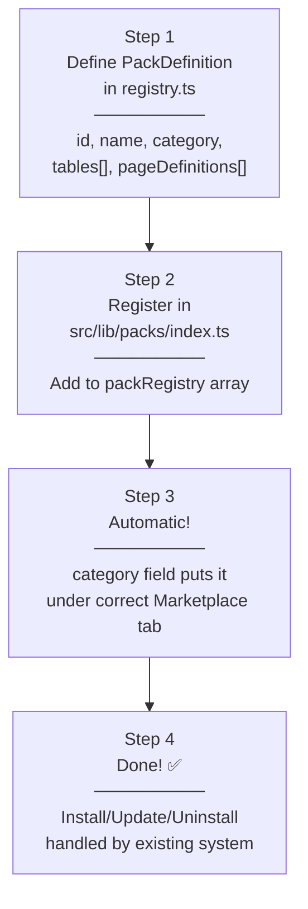

---

## 6. How to Add a New Plugin (Step by Step)

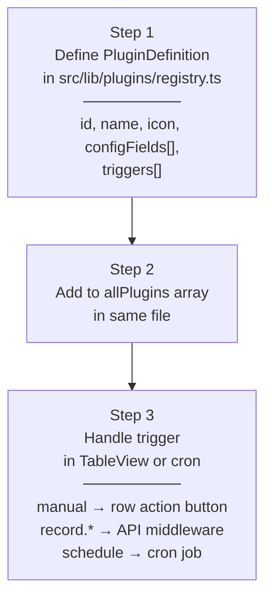

---

## 7. How to Add a New Block (Step by Step)

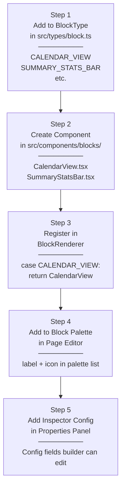

---

*End of Design Guide — ERP Builder capstone project.*
