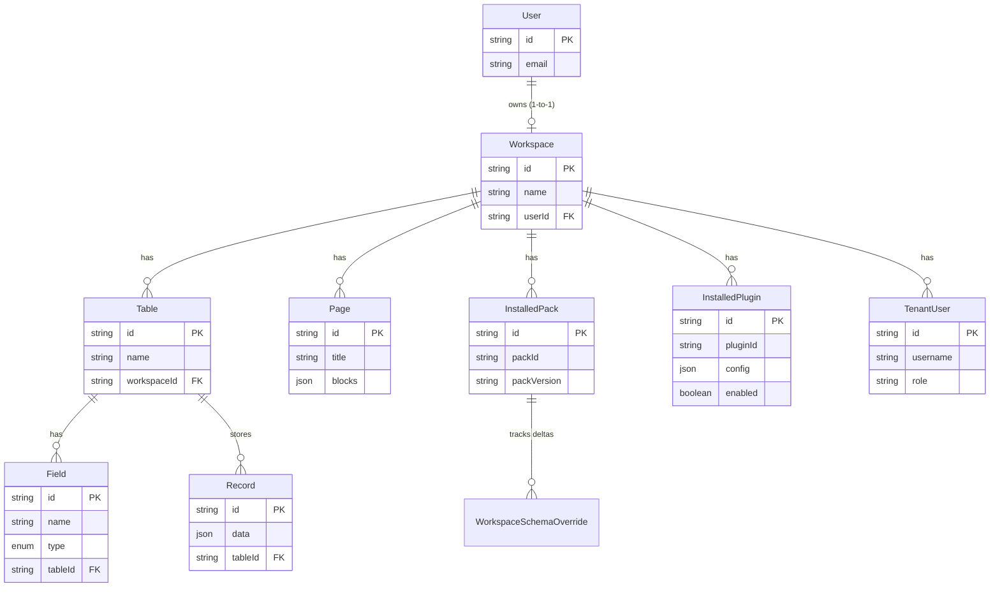
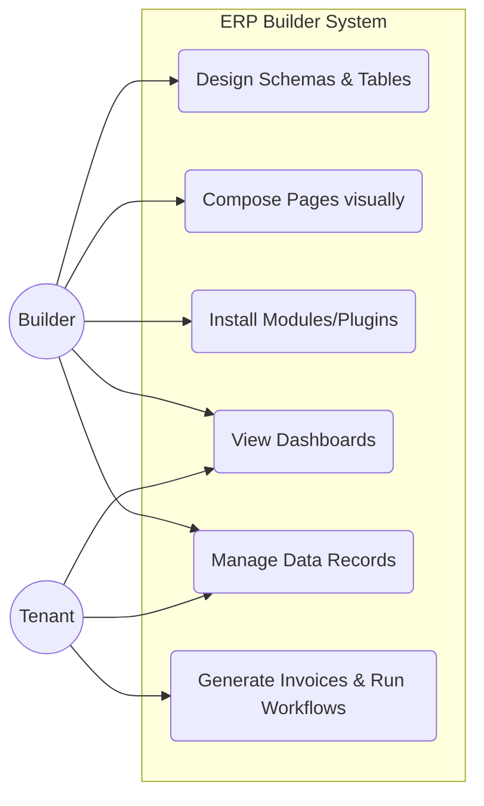
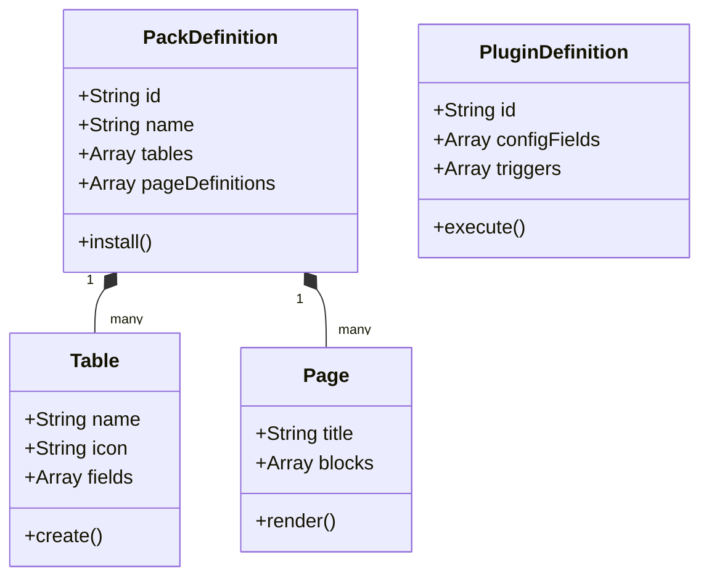
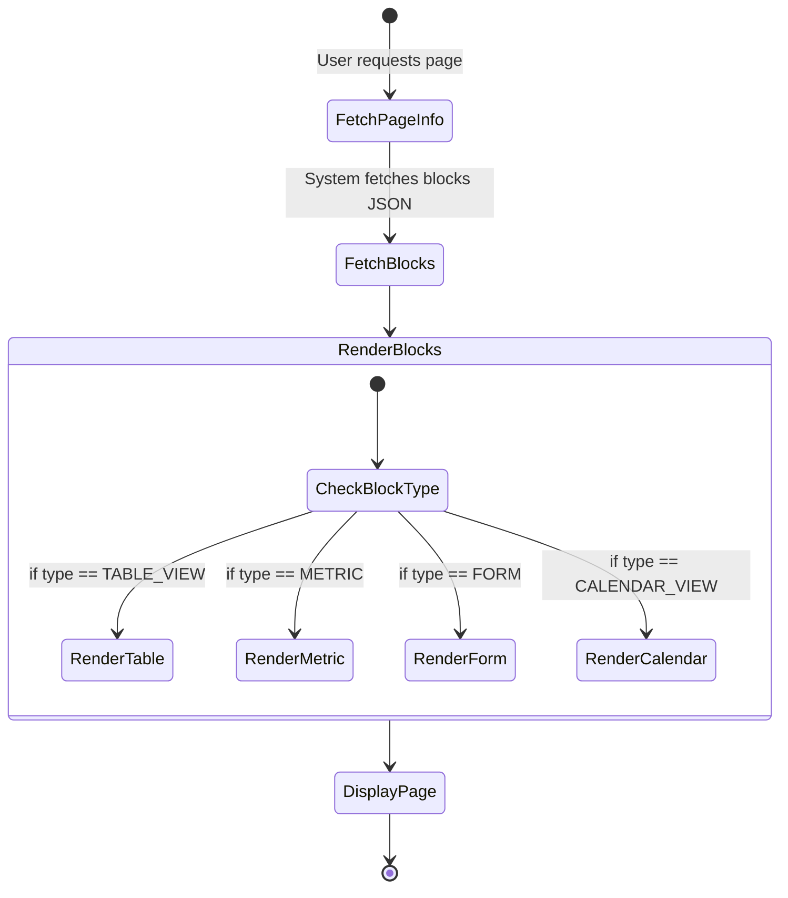
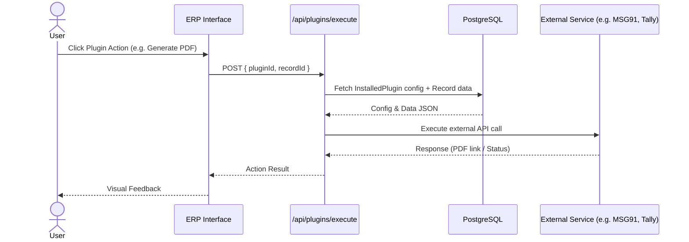
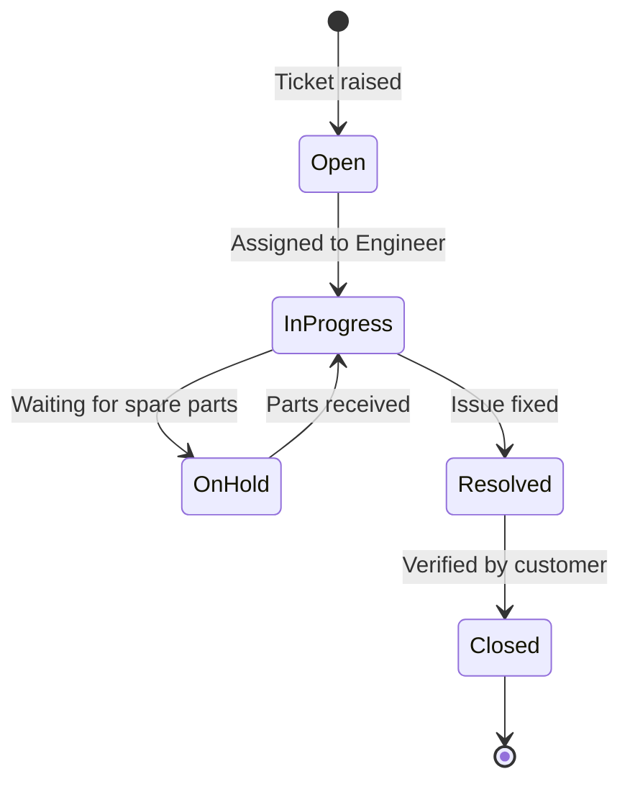
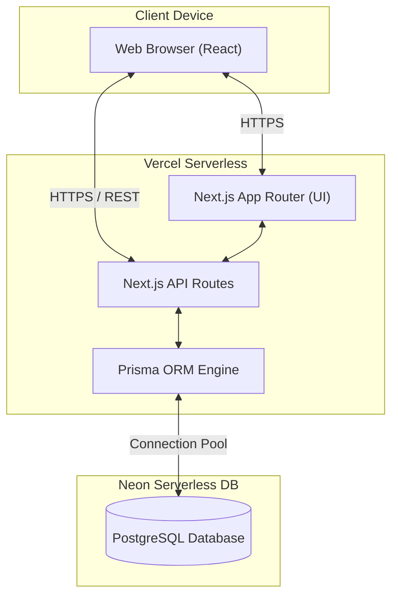
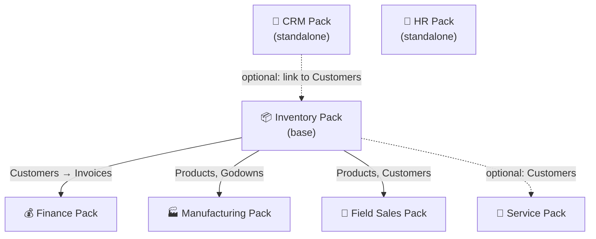
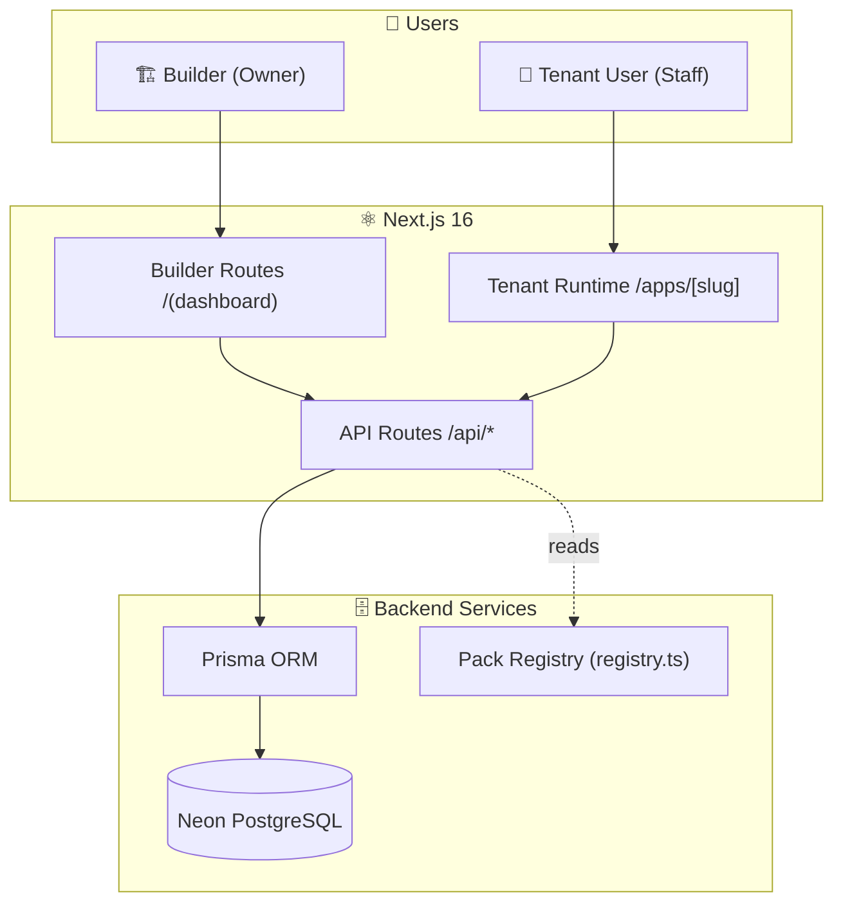
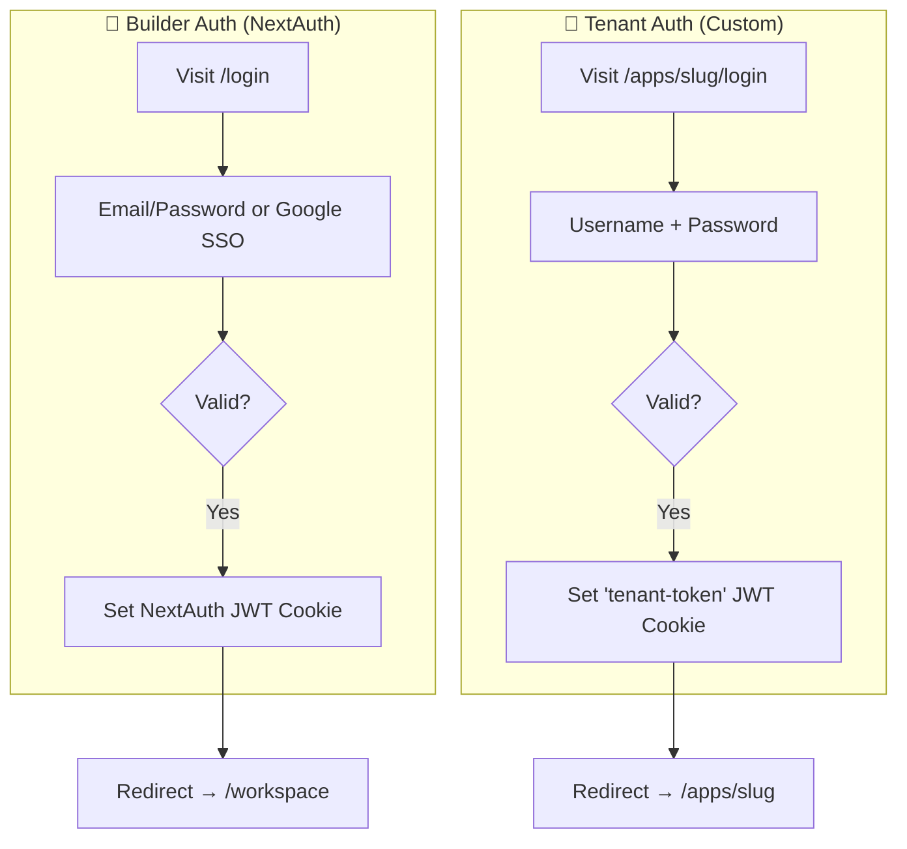

# ERP Builder — Comprehensive System Diagrams

This document contains 10 Mermaid diagrams capturing the entire architecture, data flow, and module structure of the ERP Builder application, based on the provided design files.

## 1. Entity Relationship Diagram (ERD)
Captures the isolated workspace model where builders manage tables, fields, records, and pages.

## 2. Use Case Diagram
Illustrates the separate functionalities available to the Builder (Business Owner) versus the Tenant User (Staff).

## 3. Class Diagram
Represents the data structures that define packs, tables, pages, and plugins in the registry.

## 4. Activity Diagram
Visualizes the process of a Tenant User requesting a custom page and the system rendering dynamic blocks.

## 5. Sequence Diagram
Demonstrates a plugin execution flow (e.g., generating a PDF invoice or making an external API call).

## 6. State Transition Diagram
Shows the lifecycle of a typical entity, using Service Tickets from the Service & Maintenance Pack as an example.

## 7. Deployment Diagram
Illustrates the physical architecture involving Vercel hosting, Next.js, Prisma ORM, and Neon Database.

## 8. Module Hierarchy Diagram
Maps out the dependencies across available ERP packs.

## 9. System Architecture Diagram
Details the high-level routing separation between Builder dashboard and Tenant runtime.

## 10. Authentication Flow Diagram
Clarifies the dual-authentication strategy using NextAuth for Builders and Custom JWTs for Tenants.

