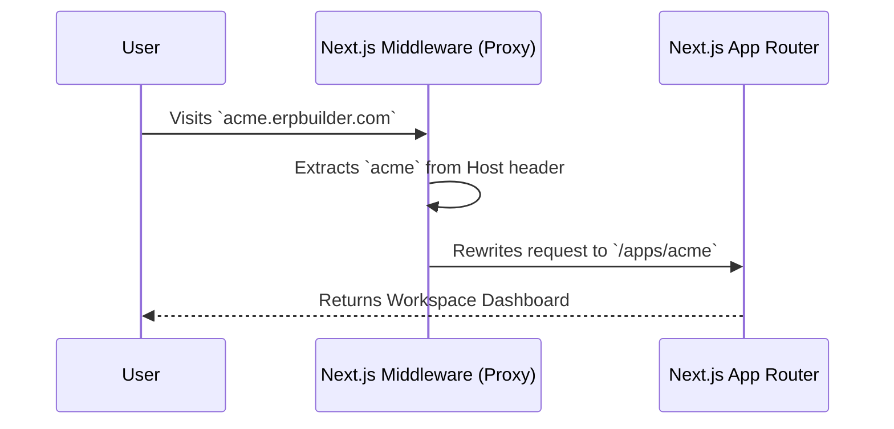

# 02 - Architecture & Multi-Tenancy (Proxy)

This document explains the overarching system architecture and how multi-tenancy is handled using Next.js Middleware (Proxy).

## The Multi-Tenant Model

ERP Builder is designed to serve multiple businesses (Tenants/Workspaces) from a single deployment.
- **Platform Layer:** The main marketing site (`/`), platform login (`/login`), and platform-level administration.
- **App Layer:** Individual workspaces mapped to specific subdomains or subdirectories (`/apps/[workspace-slug]`).

> 👶 **ELI5 (Explain Like I'm 5):**
> Multi-tenancy is like an apartment building. Instead of buying a separate house for every company (single-tenant), all companies live in the same big building. But each company has its own locked apartment with its own key, so they can't see each other's stuff.

### How Next.js Middleware (`src/proxy.ts`) Works

Instead of deploying a separate instance for every client, we use Next.js Middleware as a reverse proxy.



#### Key Responsibilities of `proxy.ts`:
1. **Host Header Parsing:** It checks if the request is coming from a custom domain/subdomain.
2. **Path Rewriting:** It intercepts the request and silently rewrites the URL to `/apps/[slug]/...`
3. **Authentication Verification:** It reads the `tenant_auth_[slug]` cookie and uses `jose` to verify the JWT token at the Edge.

> **Simplified Explanation:**
> **Middleware (Proxy)** is like the receptionist at the front desk of the apartment building. When you walk in and say "I'm going to Acme Corp", the receptionist secretly points you down hallway C to room 4 (Path Rewriting) and checks your Acme ID badge (Auth Verification) before letting you pass. You never have to know the actual room number.

*Examiner Question:* "How does the application know which company's data to show if it's hosted on a single server?"
*Answer:* "We use a multi-tenant architecture. The Next.js Middleware (`proxy.ts`) reads the subdomain from the request headers and rewrites the internal route to a dynamic segment (`/apps/[slug]`). Downstream, functions like `getWorkspace()` read this slug from the headers to scope all database queries strictly to that workspace's ID."

## Next.js App Router Structure

The project uses Next.js App Router (`src/app`) extensively, taking advantage of Route Groups (`(folderName)`) to organize layouts without affecting the URL.

```text
src/app/
├── (auth)/             # Platform login pages (no sidebar)
├── (dashboard)/        # Main builder interface (includes Sidebar & Topbar)
│   ├── admin/          # Platform super-admin controls
│   ├── modules/        # Module marketplace
│   └── schema/         # Database table schema editor
├── api/                # Backend REST endpoints (server-side)
├── apps/               # The Multi-Tenant Runtime!
│   └── [slug]/         # Dynamic route for tenant workspaces
│       └── login/      # Tenant-specific login page
└── page.tsx            # Main Landing Page
```

> **Simplified Explanation:**
> Folders with parenthesis like `(dashboard)` are just a way for developers to organize code folders without changing the website's web address. It's like putting your math homework in a blue folder and science in a red folder, but to the teacher, it's all just "homework".

## State vs Database Fetching
- The backend (`api/` routes) uses Prisma to fetch raw data.
- The frontend uses `SWR` (Stale-While-Revalidate) to fetch this data. SWR provides caching, optimistic UI updates, and auto-refresh on focus.

> **Simplified Explanation:**
> Normally, when you ask a website for data, it makes you wait staring at a blank screen. **SWR** is clever: it immediately shows you the data it remembers from last time (Stale), and quietly asks the database "did anything change?" (Revalidate). If it did, it magically updates the screen in the background.

## Design Decisions & FAQ

*Examiner Question:* "Why did you use Next.js Middleware for routing instead of deploying separate server instances for each tenant?"
*Answer:* "Deploying separate instances is extremely costly and hard to maintain. By using Middleware as a proxy, we use a single codebase and a single server. The Middleware dynamically rewrites the URL based on the subdomain, achieving multi-tenancy with zero extra infrastructure cost."

*Examiner Question:* "Why did you use SWR for data fetching instead of standard fetch?"
*Answer:* "SWR provides an optimistic UI and caching out of the box. For an ERP, if a user updates a table, SWR instantly updates the UI using cached data, then quietly revalidates with the database in the background, making the app feel incredibly fast without writing complex Redux logic."

*Examiner Question:* "How does the application scale if thousands of companies sign up?"
*Answer:* "Since the app is built on Next.js and is designed for serverless environments, it scales automatically. The Next.js Middleware handles routing with minimal latency at the Edge, and our Serverless PostgreSQL database (Neon) scales compute resources up and down based on demand."

*Examiner Question:* "What happens if two employees try to edit the same record at the exact same time?"
*Answer:* "Because we use PostgreSQL, the database handles concurrent transactions securely using ACID properties. The last write wins by default, but because we use SWR on the frontend, users will immediately see the updated data pushed by the other user upon their next focus or background revalidation."