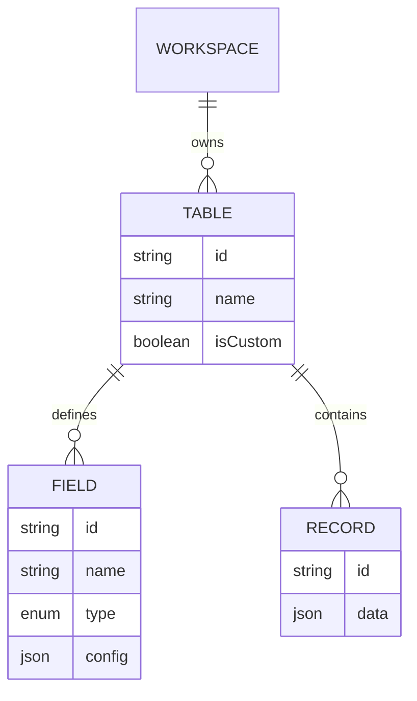

# 03 - Database Schema & Data Modeling

This document covers the Prisma schema design, explaining how generic data, multi-tenancy, and module overrides are handled.

## Multi-Tenant Core

At the core of the database is the `Workspace` model. A Workspace represents a tenant (a business using the ERP Builder).
- Every major table (`Table`, `Page`, `Record`, `ModuleDefinition`, `GlobalSearchIndex`) has a `workspaceId` foreign key.
- **Security Rule:** The backend API always enforces `where: { workspaceId: workspace.id }` ensuring tenants can never access each other's data.

> 👶 **ELI5 (Explain Like I'm 5):**
> Every single piece of data has a "Workspace ID" tag stamped on it. When Acme Corp asks for their data, the database guard strictly says "Give me only the stuff stamped with Acme Corp." This prevents data mixing.

## Generic Builder Architecture (The "EAV" Pattern)

Unlike a traditional app where you might have tables for `Employees`, `Invoices`, and `Products`, ERP builder allows users to dynamically create any data structure. It uses an Entity-Attribute-Value (EAV) style approach optimized with JSON.

- **`Table`**: Represents a data entity (e.g., "Products").
- **`Field`**: Defines the columns (e.g., "Product Name", Type: TEXT).
- **`Record`**: Stores the actual row. The magic happens here: the entire row payload is stored inside a `data` JSON column. 

> **Simplified Explanation:**
> Normally, adding a new type of data requires tearing down the database walls and building new ones. Here, we just have one giant "Records" box. We use a sticky note (`Table`) to say what the box represents, another note (`Field`) to say what questions to ask, and we throw all the answers as a single flexible document (JSON) inside the box. No wall-breaking needed!

*Examiner Question:* "How do you store dynamic tables without creating physical PostgreSQL tables for each one?"
*Answer:* "We use a metadata-driven architecture. A `Table` record defines the entity, `Field` records define the schema, and `Record` rows store the actual user data inside a `JSONB` column named `data`. This avoids expensive dynamic DDL operations while keeping queries fast."

## Module Customization & Overrides

When a user installs a built-in module (like "Inventory" or "HR"), we don't want to lose the connection to the original code schema (`registry.ts`), but we also want users to be able to rename fields or add custom fields.

This is solved by the `WorkspaceSchemaOverride` pattern:

1. **`InstalledPack`**: Tracks that Workspace A has installed "Inventory v1.2.0".
2. **`WorkspaceSchemaOverride`**: If a user renames "Product Name" to "Item Name", we DO NOT mutate the base schema. Instead, we write a `RENAME_FIELD` override row in the database.
3. **Runtime Merge:** `src/lib/schema-resolver.ts` merges the canonical Typescript schema with the database overrides at runtime, caching the result in memory for performance.

> **Simplified Explanation:**
> Imagine buying a printed book (the Module). You can't rewrite the printed text. If you want to change a word, you put a transparent sticky note over the word and write your own (The Override). When the app reads the book, it reads your sticky notes on top of the printed text (Runtime Merge).

*Examiner Question:* "If two users install the same module but customize it differently, how is that managed?"
*Answer:* "We use an event-sourcing/override model. The base schema remains pure in code. Any user customization (like adding a custom field or hiding a default one) is stored as a `WorkspaceSchemaOverride` row. Our Schema Resolver merges these deltas at runtime to produce the final schema for that specific tenant."

## Universal Search (GlobalSearchIndex)

Instead of running slow `ILIKE` scans across JSON columns for search, the app uses a flattened `GlobalSearchIndex` table.
Whenever a `Record`, `Page`, or `Table` is created/updated, a flattened text string of its contents is inserted into the `GlobalSearchIndex`. The `/api/search` route only queries this single table, making universal search incredibly fast.

> **Simplified Explanation:**
> Instead of making the search engine read every single book in the library page-by-page every time you search, we create an index card (GlobalSearchIndex) for every book that has all its important words on it. The search engine just quickly flips through the index cards.

## Design Decisions & FAQ

*Examiner Question:* "Why store record data as JSONB instead of dynamically creating PostgreSQL columns for each new field?"
*Answer:* "Running dynamic `ALTER TABLE` commands is dangerous, slow, and doesn't scale well in a multi-tenant environment. PostgreSQL's JSONB is heavily optimized. Storing data in JSONB allows tenants to add or remove fields instantly without structural database migrations, and we can still index JSONB if needed."

*Examiner Question:* "Why not just use a single database table for all data without the `workspaceId`?"
*Answer:* "Without a `workspaceId`, it is a massive security risk (Data Leakage). We chose a shared-database, isolated-schema approach where every query strictly filters by `workspaceId` to ensure Tenant A can never accidentally query Tenant B's data."

*Examiner Question:* "Why did you choose PostgreSQL over a NoSQL database like MongoDB, especially since you are storing dynamic data in JSON?"
*Answer:* "While MongoDB is great for flexible JSON documents, an ERP heavily relies on relational data (e.g., an Invoice record must relate back to the exact Table definition and Workspace). PostgreSQL gives us the best of both worlds: strict relational integrity for core system models, combined with powerful `JSONB` support for the dynamic user-generated records."