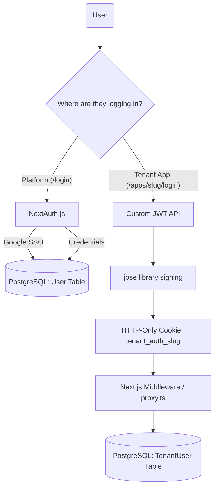

# 05 - Authentication & Security

This document details the dual authentication strategy used in ERP Builder to separate platform owners from tenant users.

## The Dual Authentication Strategy

Because this is a multi-tenant SaaS application, there are two distinct types of users:
1. **Platform Users (Builders/Owners):** The people who sign up for ERP Builder to create an ERP for their business.
2. **Tenant Users (Employees/Staff):** The people who work for the Platform User and need to log into the generated ERP subdomain.

To ensure strict security boundaries, these two user bases use completely different authentication mechanisms.

> **Simplified Explanation:**
> Imagine an airport. **Platform Users** are the Airline CEOs who buy the planes (They log in via the main website). **Tenant Users** are the passengers who just want to board their specific flight (They log in via their company's specific portal). They shouldn't use the same door.

*Examiner Question:* "Why did you use two different methods of authentication? Why not just use NextAuth for everything?"
*Answer:* "NextAuth is powerful for OAuth (like Google SSO) but it relies heavily on Node.js core modules and database sessions. Our tenant application uses Next.js Middleware to handle dynamic subdomains (`/apps/my-company`). Middleware runs on the **Edge Runtime**, which does not support Node.js APIs or heavy database queries. Therefore, for tenants, we built a custom, lightweight JWT solution using the `jose` library, which is specifically designed to run on the Edge, allowing our Middleware to verify tokens instantly without slowing down the app."

### 1. Platform Authentication (NextAuth.js)

The main platform (`acme.com/login`) uses **NextAuth.js** (`next-auth`).
- **Strategy:** Database session strategy using the Prisma adapter (`@prisma/client`).
- **Features:** 
  - Standard Email/Password login (using `bcryptjs` for hashing).
  - **Google SSO:** Configured using the `GoogleProvider` inside `src/lib/auth.ts`. When a user signs in via Google, NextAuth automatically provisions a user row in the database.

> **Simplified Explanation:**
> **NextAuth** is like the airport's official security team. If an Airline CEO wants to enter, they can either show their ID (Email/Password) or say "Google knows me" (Google SSO), and the security team verifies them against the master database.

*Examiner Question:* "How did you implement Google Login?"
*Answer:* "We used the `GoogleProvider` from `next-auth`. In `src/lib/auth.ts`, we hooked into the `signIn` and `jwt` callbacks. If a user signs in via Google for the first time, our callback automatically provisions a `User` row in the database and links their workspace."

### 2. Tenant Authentication (Custom JWT via `jose`)

Tenant users access the system via dynamic subdomains or subpaths (e.g., `acme.com/apps/my-company`). NextAuth is not designed to handle highly dynamic, dynamically generated tenant boundaries effectively in Edge environments.

Instead, we built a custom JWT solution:
- **Library:** `jose` (Used instead of `jsonwebtoken` because `jose` is Edge Runtime compatible, allowing us to verify tokens directly in Next.js Middleware).
- **Process:**
  1. Employee visits `/apps/my-company/login`.
  2. They submit their username/password.
  3. The API (`src/app/api/tenant/login/route.ts`) verifies credentials using `bcryptjs`.
  4. It calls `signTenantToken()` from `src/lib/tenant-auth.ts` to create a signed JWT containing their ID and Role.
  5. A secure, HTTP-only cookie (`tenant_auth_[slug]`) is set on the browser.
  6. **Middleware:** On subsequent requests, `src/proxy.ts` (Next.js Middleware) extracts this cookie, calls `verifyTenantToken()`, and blocks access if invalid.

> **Simplified Explanation:**
> Because there are thousands of companies, we don't check the master database every time a passenger moves. Instead, when they first log in, we give them an unforgeable digital wristband (JWT) created by a library called **jose**. This wristband is hidden in their browser (HTTP-Only Cookie). The security guard at the hallway (Middleware) just glances at the wristband and instantly knows if they belong there.

### Summary Diagram

## Design Decisions & FAQ

*Examiner Question:* "How are user passwords stored in the database?"
*Answer:* "Passwords are never stored in plain text. We use the `bcryptjs` library to cryptographically hash and salt the passwords before saving them. This means even if the database is compromised, the actual passwords cannot be reverse-engineered."

*Examiner Question:* "What happens if a tenant employee's JWT token is stolen via a malicious script?"
*Answer:* "We mitigate this risk by storing the JWT token as an `HTTP-Only` cookie. This means malicious JavaScript (like in an XSS attack) cannot read the cookie at all. Additionally, the token has a strict expiration time set during signing, further limiting any potential window of abuse."