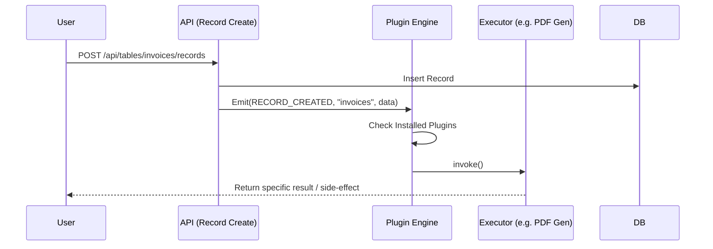

# 06 - Marketplace, Modules, and Plugins

This document explains how the ERP Builder's Marketplace works, including how Modules (Packs) are installed, updated, and how Plugins execute backend logic.

## Modules (Schema Packs)

Instead of forcing users to build their ERP from scratch table-by-table, we provide "Modules" (e.g., Inventory, CRM, HR).

- **Registry (`src/lib/packs/registry.ts`):** Modules are defined in code as JSON-like objects of type `PackDefinition`. They contain an array of `tables` (with predefined `fields` and `seedData`) and `pageDefinitions` (pre-configured dashboards).
- **Installation Process (`/api/packs/install`):**
  When a user clicks "Install" on the Inventory module:
  1. The backend reads the definition from `registry.ts`.
  2. It dynamically provisions `Table` and `Field` rows in PostgreSQL.
  3. It inserts `seedData` as `Record` rows so the user has immediate dummy data.
  4. It generates `Page` rows for the pre-built dashboards.
  5. It creates an `InstalledPack` row to track the version.

> **Simplified Explanation:**
> A **Module** is like a pre-furnished house package. Instead of buying individual tables and chairs, you buy the "Kitchen Package". When you hit install, the system automatically builds the tables, adds the columns, and even puts dummy data in so you see exactly how it works.

### The "Update" Flow

*Examiner Question:* "What happens if you update a module in code? Do existing users get the updates?"
*Answer:* "Yes. We built a strictly additive sync engine (`src/app/api/packs/update/route.ts`). If we bump a pack version in `registry.ts` and add a new field (e.g., adding `GST Rate (%)` to the Products table), the frontend shows an 'Update' button. The sync engine compares the DB state with `registry.ts` and pushes only the missing tables, fields, or pages without deleting or overwriting any of the user's data."

> **Simplified Explanation:**
> If we upgrade the "Kitchen Package" to include a Microwave, our sync engine just walks into your house and adds the Microwave. It NEVER deletes your existing fridge or throws away the custom paint job you did.

## Plugins (Logic Executors)

While Modules provide data structure (Schema) and views (Pages), **Plugins provide Backend Logic**.

- **Structure:** Plugins are stored in `src/lib/plugins/registry.ts` and their logic lives in `src/lib/plugins/executors/`.
- **How they work:**
  Plugins act as event listeners. A plugin defines `triggers`. For example, the `whatsapp-alerts` plugin triggers on `RECORD_CREATED` for the `Stock` table.
- **Execution:** When a record is created via the API, the backend checks for enabled plugins, finds matching triggers, and invokes the plugin's executor function dynamically.

> **Simplified Explanation:**
> Modules give you the physical objects. **Plugins** are like smart home automation. You set a rule (trigger) saying "If someone rings the doorbell (Record Created), flash the living room lights (Invoke Executor function)". 

### Notable Plugins
- **GST Invoice Generator:** Uses `jspdf` and `jspdf-autotable` to turn Record JSON data into formatted PDF invoices.
- **Razorpay Payment Links:** Uses standard `fetch` to call Razorpay's API to generate a payment link, then uses `qrcode` to generate a Base64 QR code image for display.
- **WhatsApp Alerts:** Simulated plugin logic that formats strings and prepares API payloads.

## Design Decisions & FAQ

*Examiner Question:* "Why do you use an 'Additive Sync' model for module updates?"
*Answer:* "We want to give users new features (like a new GST field) without wiping out their custom changes. The additive sync only adds missing tables and fields; it intentionally refuses to delete or rename existing user data, ensuring updates are always safe."

*Examiner Question:* "Why use a Plugin system for backend logic instead of hardcoding features?"
*Answer:* "Extensibility. An ERP needs to connect to hundreds of third-party tools (like Razorpay, WhatsApp, or Tally). Hardcoding them creates a monolithic, messy codebase. By using an event-driven Plugin engine, we keep the core lean and only execute specific logic if the tenant has enabled that plugin."

*Examiner Question:* "Can a user write their own custom code in a Plugin?"
*Answer:* "Currently, plugins are pre-built by us (the platform developers) in `registry.ts` to ensure system stability. If users could write arbitrary backend code, it would introduce severe security risks (Remote Code Execution). Safely running user-provided code would require building a complex, sandboxed execution environment (like WebAssembly or secure Docker containers), which is beyond the current scope."