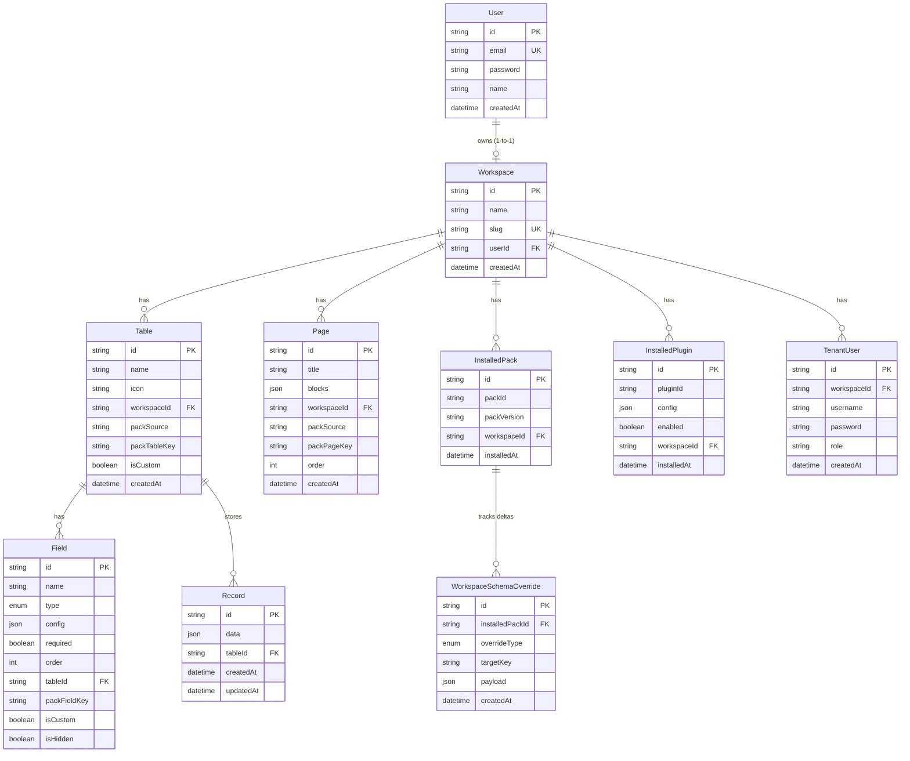
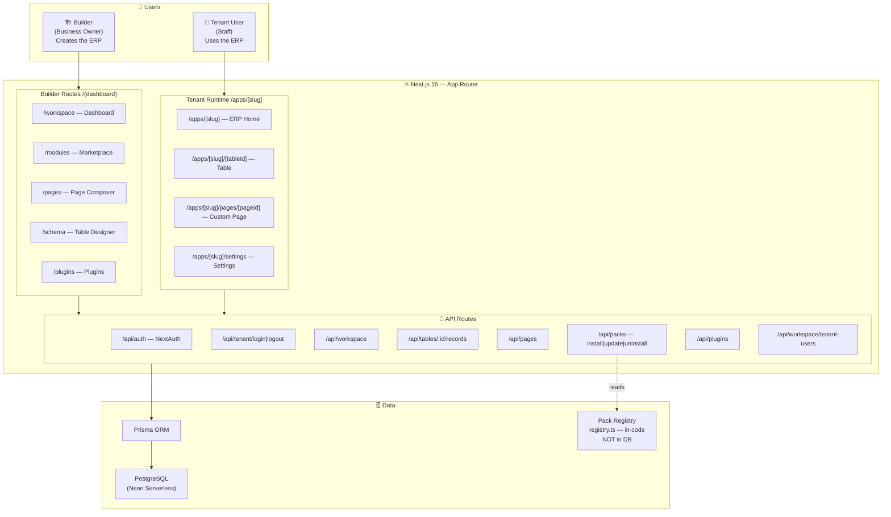
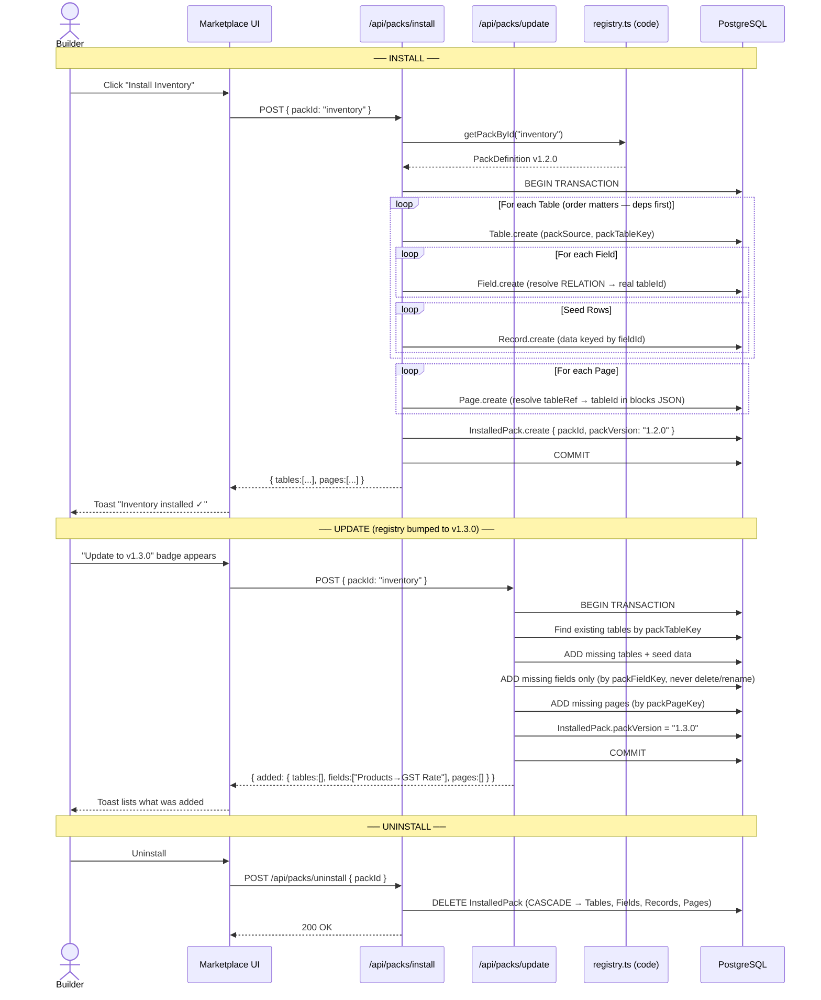
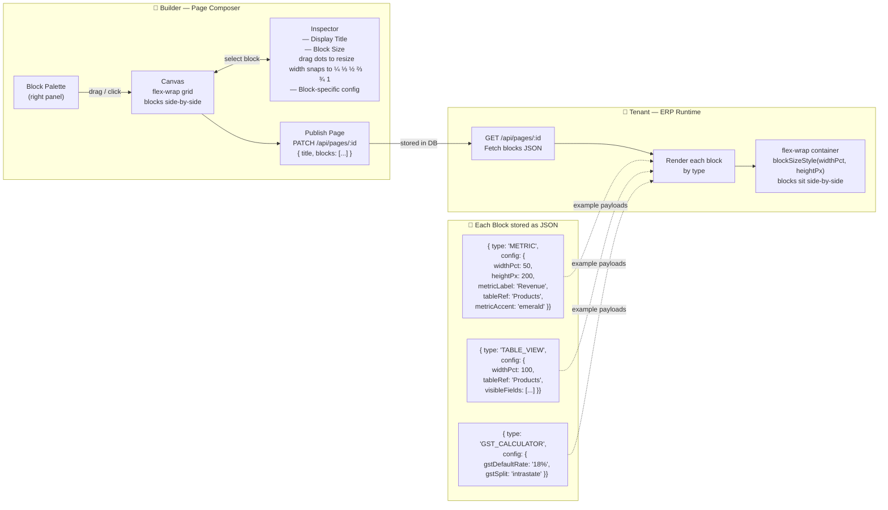
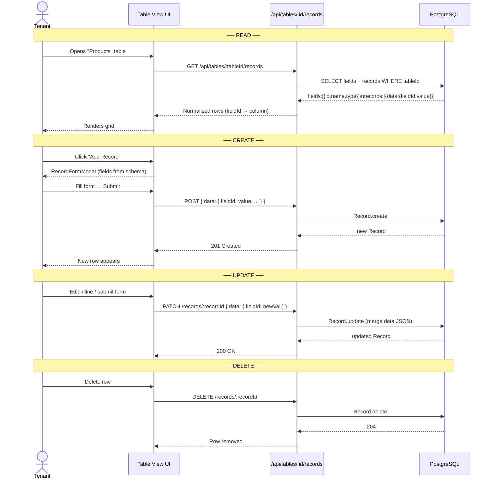
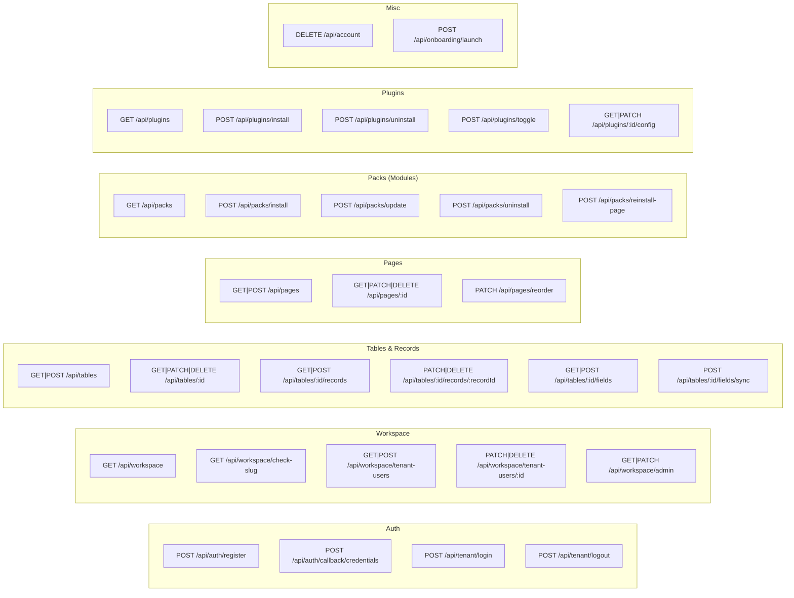
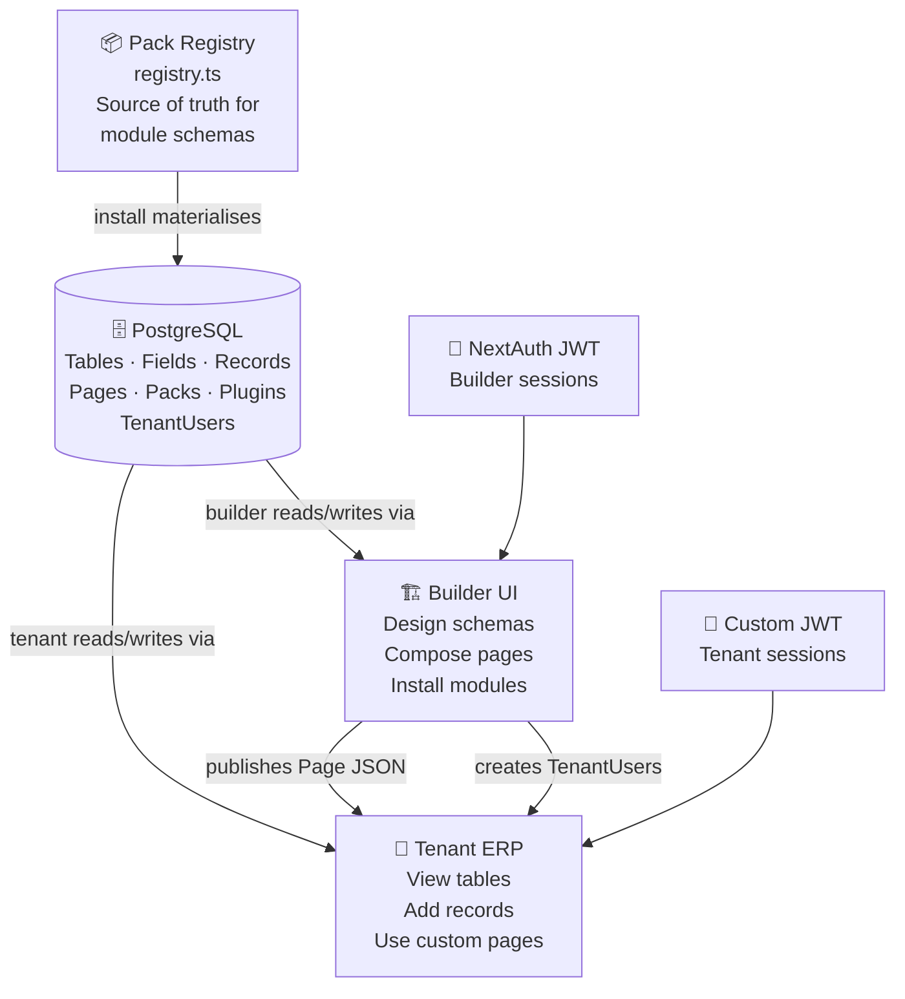

# ERP Builder — System Design

> All diagrams are in Mermaid format — GitHub renders them automatically.
> Use [mermaid.live](https://mermaid.live) to open any individual block interactively.

---

## 1. ER Diagram (Database Schema)

Every workspace gets its own isolated copy of tables, records, pages, and pack installs. The only shared data is the `PackDefinition` which lives in code (`registry.ts`), not the DB.

**Key design decisions:**
- `packSource` + `packTableKey` / `packFieldKey` — provenance tags so the update engine can find canonical fields even after the user renames them.
- `Record.data` is a flat JSON blob keyed by **field IDs** (not names), so renames never corrupt data.
- `WorkspaceSchemaOverride` stores only the user's *delta* on top of the canonical pack — never duplicates the full schema.

---

## 2. High-Level System Architecture

Two distinct user types hit the same Next.js app but through completely different route groups.

---

## 3. Authentication Flow

The app runs **two independent auth systems** in parallel — one for builders, one for their staff.

```mermaid
flowchart TD
    subgraph BuilderAuth["🔐 Builder Auth — NextAuth JWT"]
        B1["Visit /login"] --> B2{"Provider?"}
        B2 -->|Email + Password| B3["POST /api/auth/callback/credentials\nbcrypt.compare()"]
        B2 -->|Google SSO| B4["OAuth Redirect\nGOOGLE_CLIENT_ID required"]
        B3 --> B5{"Password valid?"}
        B5 -->|No| B6["401 — back to /login"]
        B5 -->|Yes| B7["NextAuth writes JWT\nhttpOnly cookie\nPayload: id, email, workspaceId"]
        B4 --> B8["Auto-create workspace\nif first Google login"]
        B8 --> B7
        B7 --> B9["Redirect → /workspace"]
    end

    subgraph TenantAuth["🔐 Tenant Auth — Custom JWT"]
        T1["Visit /apps/slug/login"] --> T2["POST /api/tenant/login\nbody: username + password"]
        T2 --> T3["Lookup TenantUser WHERE\nworkspaceId + username"]
        T3 --> T4{"bcrypt.compare?"}
        T4 -->|No| T5["401 Unauthorized"]
        T4 -->|Yes| T6["sign JWT with NEXTAUTH_SECRET\nSet 'tenant-token' httpOnly cookie\nPayload: userId, workspaceId, role"]
        T6 --> T7["Redirect → /apps/slug"]
    end

    subgraph Logout["🚪 Logout"]
        BL["Builder: signOut()\nClears NextAuth cookie"] 
        TL["Tenant: POST /api/tenant/logout\nClears tenant-token cookie"]
    end
```

---

## 4. Pack (Module) Lifecycle

A **Pack** is a pre-built ERP module (e.g. Inventory). It lives as a `PackDefinition` object in `registry.ts` (code). Installing it *materialises* a copy into the workspace's DB tables.

---

## 5. Page Composer — Builder to Runtime

The **Page Composer** lets builders visually assemble pages from blocks. The page is stored as a JSON array of blocks in `Page.blocks`. The **ERP Runtime** reads that JSON and renders the actual UI.

**Supported block types:**

| Type | What it renders |
|---|---|
| `TEXT` | Page heading + description |
| `METRIC` | KPI card — static value or live record count |
| `TABLE_VIEW` | Full data grid (sortable, editable inline) |
| `KANBAN_VIEW` | Drag-and-drop kanban board |
| `FILTER_BAR` | Search input + optional date range |
| `FORM` | Add-record form auto-generated from schema |
| `EXPORT_BUTTON` | CSV download (BOM-prefixed for Excel) |
| `IMAGE` | Logo / banner with alignment |
| `GST_CALCULATOR` | CGST+SGST or IGST calculation |
| `CHART` | Placeholder (data source WIP) |

---

## 6. Record CRUD — Data Flow

Records are the actual business data (rows in a table). The data is a JSON blob keyed by **field IDs** so renames never break anything.

---

## 7. Full API Route Map

---

## Summary — How Everything Connects

